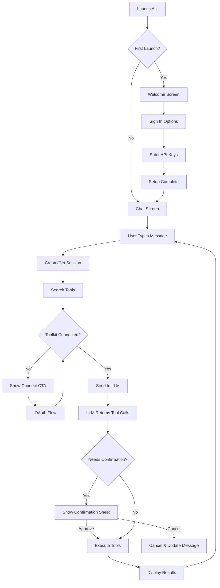
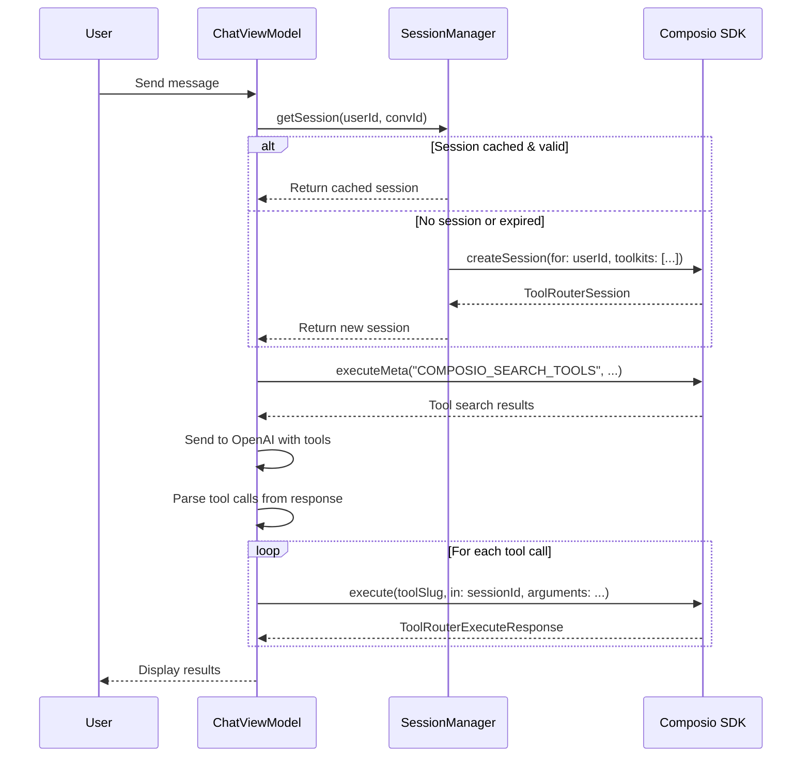
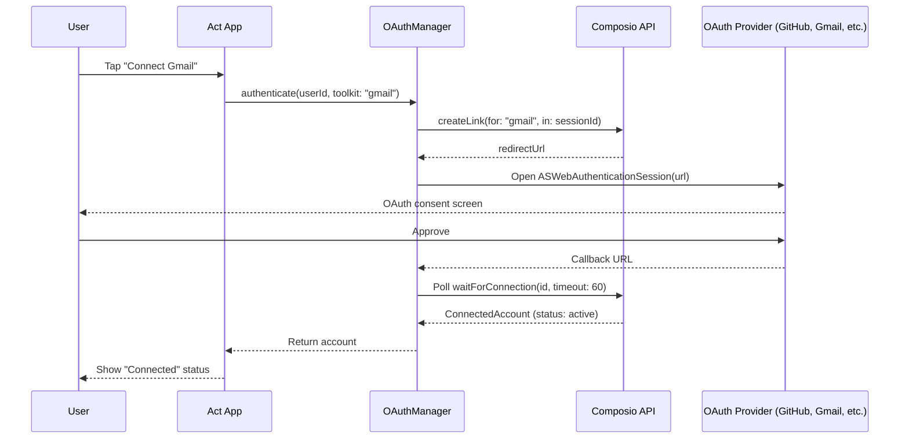
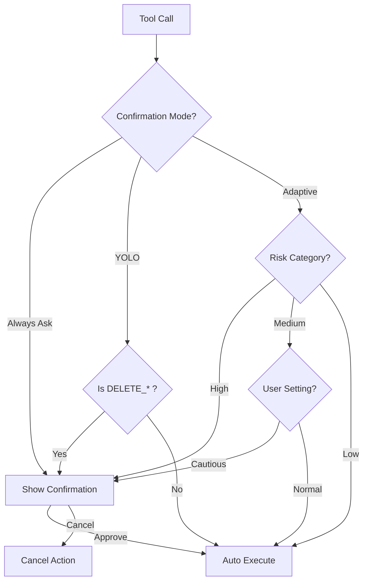
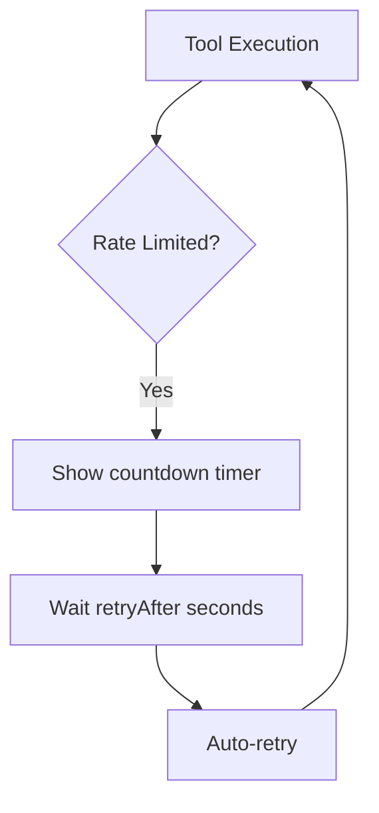
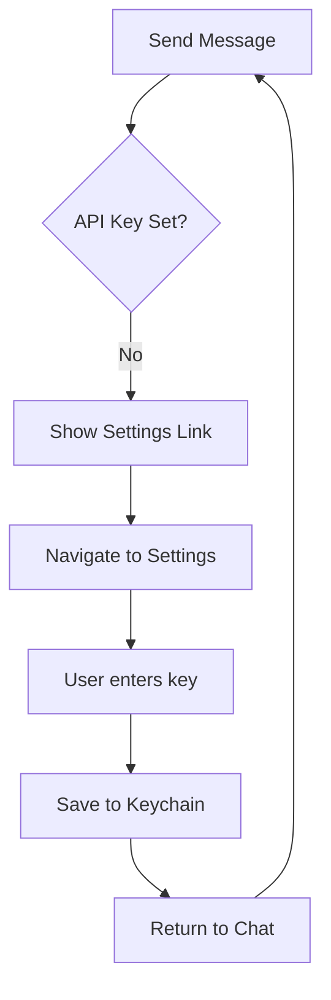
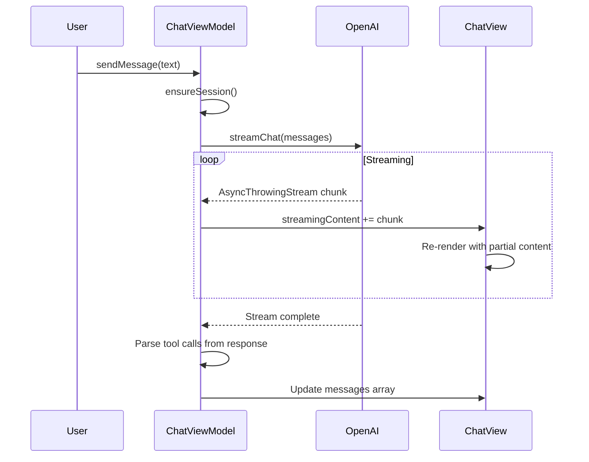

# User Flow Documentation

## Core User Journey



---

## Session Lifecycle



---

## OAuth Flow



---

## Confirmation Logic

### Decision Tree



### Risk Categories

| Category | Examples | Default Action |
|----------|----------|----------------|
| Low | FETCH, GET, SEARCH, LIST | Auto-execute |
| Medium | CREATE_DRAFT, UPDATE (private) | Depends on mode |
| High | SEND, DELETE, POST (public) | Always confirm |

---

## Error Recovery Flows

### Connection Required

```mermaid
flowchart TD
    A[Tool Execution] --> B{Connected?}
    B -->|No| C[Display "Connect Gmail" button]
    C --> D[User taps Connect]
    D --> E[OAuth Flow]
    E --> F{Success?}
    F -->|Yes| G[Retry original request]
    F -->|No| H[Show error + retry option]
```

### Rate Limited



### API Key Missing



---

## Screen Flow Summary

| Screen | Entry Points | Exit Points |
|--------|--------------|-------------|
| Welcome | App launch (first time) | Settings complete → Chat |
| Chat | App launch (always visible) | Confirmation sheet, Sidebar |
| Confirmation | Tool needs approval | Approve → Chat, Cancel → Chat |
| Connections | Sidebar → Connections | OAuth success → Chat |
| Settings | Sidebar → Profile/Settings | Save → Chat |

---

## Streaming Response Flow



### Implementation Pattern

```swift
for try await chunk in streamChat(message: text) {
    await MainActor.run { 
        streamingContent += chunk 
    }
}
```

---

## Deep Links

| URL Scheme | Purpose | Handler |
|------------|---------|---------|
| `act://oauth-callback` | OAuth completion | OAuthManager |
| `act://chat?prompt=...` | Open chat with prompt | ChatView |
| `act://settings` | Open settings | SettingsView |
